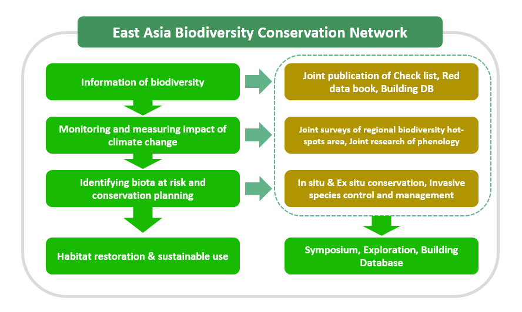

## Background

* The IPCC Fourth Assessment Report(2007) alarmed on the increasing level of climate change and its impact to the environmental degradation in the future: The average world temperature rose 0.76 ℃ from 1850 to 2005; the average temperature will rise 1.4-5.8 ℃ more by 2100; the grassland will become desert; the forest will be destroyed; and in 50 years from then over 1/3 of the earth plants and animals will be extinct or will be endangered.

* The degree of climate change in East Asia is in much more serious level than the world average level, estimated to be increased of average temperature to 3.5 ℃ and of the rainfall amount to 4.5%, which urgently calls the cooperation within the countries to diminish it.

* The East Asia is the area where many plant species are commonly distributed including rare and endemic plant species.

* It is necessary to establish the East Asia Biodiversity Conservation Network to provide the basis for promoting conservation and sustainable use of forest plant resources.

## EABCN joint research topics

* Research on the monitoring of species distribution by climate change

* Development of East Asia Integrated flora (Check list)

* Monitoring on exotic plants and building data sharing platform

* Strengthening the research capacity and human resources

## Progress
### The progress of the establishment and development of the EABCN has been in:

* Proposed agenda in the 5th IUCN World Conservation Congress (WCC) in September 2012 (Jeju)

* Delegated a Working Group and Regional Focal Point of each institute in September 2012 (Valdivostok Botanical Garden)
 
* Signed a Letter of Intent (LOI) to build the East Asia Biodiversity Conservation Network agreement in November 2013 (Korea National Arboretum)
 
* Convened a Working Group Meeting for multilateral MOU and discussed on topics of joint researches in April 2014 (Seoul)
 
* Published Important plant species guide book in East Asia and signed on the multilateral MOU in October 2014 (Pyeongchang)
 
* Convened a Working Group Meeting for Atlas of the Vascular Plants in East Asia and Publication in April 2015 (Seoul)
 
* Convened the Steering Committee Meeting for joint research and the EABCN Workshop on Climate Change Impact Monitoring in June 2015 (Tsukuba)
 
* Oraganized the Special Committee Meeting for revision Rules of Procedure (ROP) in July 2015 (Jeju)
 
* Formed 4 Working Groups to promote joint research and amended the Articles of Incorporation to expand membership in July 2016 (Mongolia)
 
* Re-elected the EABCN Chairperson and made Efforts to Expand Membership in July 2017 (Guangzhou)
 
* Changed EABCN operating regulations and approved membership in June 2018 (Shenyang)
 
* Ended EABCN Phase 1 and made a Proposal for Phase 2 Direction in September 2019 (Vladivostok)
 
* Presented the 2nd EABCN Working Group Operational Strategy in December 2019 (Jeju)

